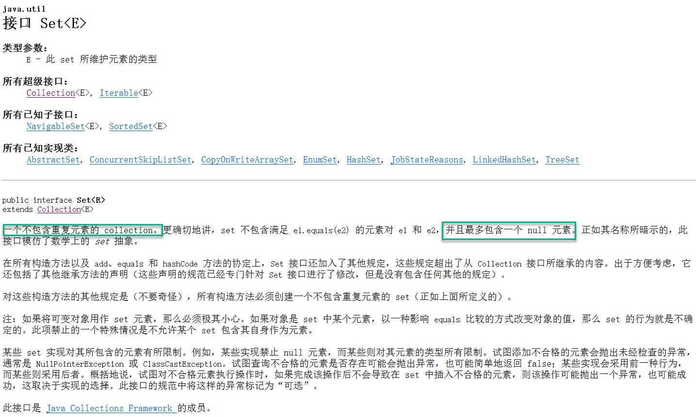

## List、Set、Map的区别

### List和Set区别
#### List

   
- 可以允许重复的对象。
- 可以插入多个null元素。
- 是一个有序容器，保持了每个元素的插入顺序，输出的顺序就是插入的顺序。
- 常用的实现类有ArrayList、LinkedList和Vector。
    - ArrayList最为流行，它提供了使用缩印的随意访问，而LinkedList则对于经常需要从List中添加或删除元素的场合更为合适。
#### Set

  
- 不允许重复对象。
- 无序容器，无法保证每个元素的存储顺序，TreeSet通过Comparator或者Comparable维护了一个排序顺序。
- 只允许一个null元素
- Set接口最流行的几个实现类是HashSet、LinkedHashSet以及TreeSet。
    - 最流行的是基于HashMap实现的HashSet。
    - TreeSet还实现了SortedSet接口，因此TreeSet是一个根据其compare()和compareTo()的定义进行排序的有序容器。
### Map

- **Map不是collection的子接口或者实现类。Map是一个接口。**
- Map的每个Entry都持有两个对象，也就是一个键一个值，Map可能会持有相同的值对象但键对象必须唯一。
- TreeMap也通过Comparator或者Comparable维护了一个排序顺序。
- Map里可以拥有随意个null值，但最多只能有一个null键。
- Map接口最流行的几个实现类是HashMap、LinkedHashMap、Hashtable和TreeMap。(HashMap、TreeMap最常用)
### 什么场景下使用List、Set、Map
1. 如果经常会使用索引来对容器中的元素进行访问，那么List是正确的选择。如果已经知道索引了的话，那么List的实现类，比如ArrayList可以提供更快速的访问，如果经常添加删除元素，那么肯定要选择LinkedList。
2. 如果想容器中的元素能够按照它们插入的次序进行有序存储，那么还是List，因为List是一个有序容器，它按照插入顺序进行存储。
3. 如果想保证插入元素的唯一性，也就是不想有重复值出现，那么可以选择一个Set的实现类，比如HashSet、LinkedHashSet或TreeSet。所有Set的实现类都遵循了统一约束，比如唯一性，而且还提供了额外的特性比如TreeSet还是一个SortedSet，所有存储于TreeSet中的元素可以使用Java里的Comparator或Comparable进行排序。LinkedHashSet也按照元素的插入顺序对它们进行存储。
4. 如果你以键和值得形式进行数据存储那么Map是正确的选择。可以根据后续需要从Hashtable、HashMap、TreeMap中进行选择。
