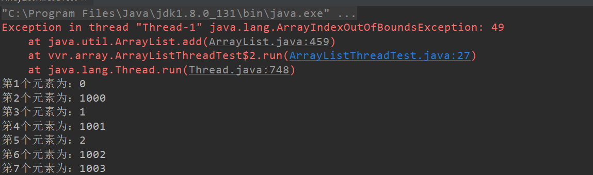
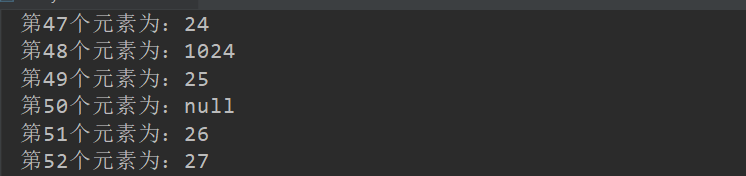

# 为什么说ArrayList是线程不安全的？

原文:https://blog.csdn.net/u012859681/article/details/78206494

## 源码分析

```java
public class ArrayList<E> extends AbstractList<E>
        implements List<E>, RandomAccess, Cloneable, java.io.Serializable
{
    /**
     * 列表元素集合数组
     * 如果新建ArrayList对象时没有指定大小，那么会将EMPTY_ELEMENTDATA赋值给elementData，
     * 并在第一次添加元素时，将列表容量设置为DEFAULT_CAPACITY 
     */
    transient Object[] elementData; 

    /**
     * 列表大小，elementData中存储的元素个数
     */
    private int size;
}
```

通过这两个字段可以看出，ArrayList的实现主要就是用来一个Object的数组，用来保存所有的元素，以及一个size变量用来保存当前数组中已经添加了多少元素。

add操作时的源码：

```java
public boolean add(E e) {

    /**
     * 添加一个元素时，做了如下两步操作
     * 1.判断列表的capacity容量是否足够，是否需要扩容
     * 2.真正将元素放在列表的元素数组里面
     */
    ensureCapacityInternal(size + 1);  // Increments modCount!!
    elementData[size++] = e;
    return true;
}
```

ensureCapacityInternal()这个方法作用就是判断如果将当前的新元素加到列表后面，列表的elementData数组的大小是否满足，如果size+1的这个需求长度大于elementData这个数组的长度，那么就要对这个数组进行扩容。

由于add元素时，实际做了两个大的步骤：

1. 判断elementData数组容量是否满足需求。
2. 在elementData对应位置上设置值。

**这样就出现了第一个导致线程不安全的隐患，**在多个线程进行add操作时，可能会导致elementData数组越界。具体：

1. 列表大小为9，即size=9
2. 线程A开始进行add方法，这时它获取到的size值为9，调用ensureCapacityInternal()方法进行容量判断。
3. 线程B此时也进入add方法，它获取到size的值也为9，调用ensureCapacityInternal()方法。
4. 线程A发现需求大小为10，而elementData的大小就为10，可以容纳。于是不再扩容，返回。
5. 线程B也发现需求大小为10，也可以容纳，返回。
6. 线程A开始进行设置值操作，elementData[size++] = e操作。此时size变为10.
7. 线程B也开始进行设置值操作，它尝试设置elementData[10]=e，而elementData没有进行过扩容，它的下标最大为9、此时会爆出一个数组越界的异常。

另外第二步elementData[size++] = e**这只值的操作同样会导致线程不安全。**从这可以看出，这不操作也不是原子操作，它由如下两步操作构成:

```java
elementData[size] = e;
size = size + 1;
```

在单线程执行这两条代码时没有任何问题，但是当多线程环境下执行时，可能就会发生一个线程的值覆盖另一个线程添加的值，具体逻辑如下：

1. 列表大小为0，即size为0
2. 线程A开始添加一个元素，值为A。此时它执行第一条操作，将A放在了elementData下标为0的位置上。
3. 接着线程B刚好也要开始添加一个值为B的元素，且走到了第一步操作。此时线程B获取到size的值依然为0，于是它将B也放在了elementData下标为0的位置上。
4. 线程A开始将size的值增加为1
5. 线程B开始将size的值增加为2

这样线程A，线程B执行完毕后，理想情况为size为2，elementData下标0的位置为A，下标1的位置为B。而实际情况编程了size为2，elementData下标为0的位置变为了B，下标1的位置上什么都没有。并且后续除非使用set方法修改此位置的值，否则将一直为null，因为size为2，添加元素时会从下标为2的位置上开始。

## 案例复现

```java
package vvr.array;

import java.util.ArrayList;

public class ArrayListThreadTest {
    public static void main(String[] args) throws InterruptedException {
        final ArrayList<Integer> list = new ArrayList<Integer>();
        new Thread(new Runnable() {
            @Override
            public void run() {
                for (int i = 0; i < 1000; i++) {
                    list.add(i);
                    try {
                        Thread.sleep(1);
                    } catch (InterruptedException e) {
                        e.printStackTrace();
                    }
                }
            }
        }).start();


        new Thread(new Runnable() {
            @Override
            public void run() {
                for (int i = 1000; i < 2000; i++) {
                    list.add(i);
                    try {
                        Thread.sleep(1);
                    } catch (InterruptedException e) {
                        e.printStackTrace();
                    }
                }
            }
        }).start();

        Thread.sleep(1000);
        for (int i = 0; i < list.size(); i++) {
            System.out.println("第" + (i + 1) + "个元素为：" + list.get(i));
        }
    }
}
```





从运行结果可以看到，会出现数组越界异常，也有可能出现值为null的情况。